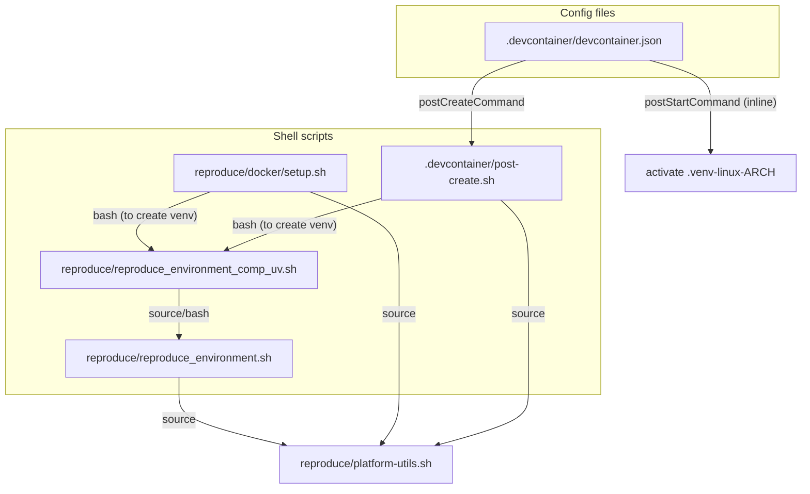

# Cross-Platform Virtual Environment Architecture

This document explains how a single workspace directory can be shared
between native macOS and Linux-based Docker/devcontainers, with each
context activating a Python virtual environment compiled for the correct
CPU architecture. It is written for an AI that wants to replicate this
pattern in a similarly structured repository.

## The problem

A research project has a single workspace tree checked out on disk.
That same tree is used in two ways:

1. **Natively on macOS** (e.g., Apple Silicon arm64 or Intel x86_64).
2. **Inside a Docker container or VS Code devcontainer** (Linux x86_64
   or aarch64), where the workspace is bind-mounted.

Python virtual environments contain compiled C extensions (numpy, scipy,
etc.) that are specific to both the OS and the CPU architecture. A venv
created on macOS arm64 will crash if activated inside a Linux x86_64
container, and vice versa. A naive `.venv/` directory would be
overwritten every time the user switches contexts.

## The solution: architecture-specific venv naming

Instead of a single `.venv/`, each context creates a venv whose
directory name encodes the platform and architecture:

```
.venv-darwin-arm64/      # macOS Apple Silicon
.venv-darwin-x86_64/     # macOS Intel
.venv-linux-x86_64/      # Linux (most Docker containers)
.venv-linux-aarch64/     # Linux ARM (e.g., Graviton, Ampere)
```

All of these directories can coexist in the same workspace tree
simultaneously. Scripts detect which one to use at runtime, so switching
between native macOS and a devcontainer requires no manual intervention.

A convenience symlink `.venv -> .venv-{platform}-{arch}` is maintained
so that tools requiring a static path (e.g., VS Code's
`python.defaultInterpreterPath`) always resolve correctly.

## File layout

All architecture detection and venv resolution logic lives in a single
shared library that every other script sources:

```
reproduce/
  platform-utils.sh                  # Shared library (single source of truth)
  reproduce_environment.sh           # Creates/updates the venv using UV
  reproduce_environment_comp_uv.sh   # Thin wrapper that delegates to reproduce_environment.sh
  docker/
    setup.sh                         # Runs inside devcontainers (TeX Live + UV setup)
    run-setup.sh                     # Locates and invokes setup.sh
.devcontainer/
  devcontainer.json                  # VS Code devcontainer config
  post-create.sh                     # postCreateCommand handler
```

### Dependency graph



## The shared library: `platform-utils.sh`

This file provides five functions. Every script that needs to know which
venv to use sources it via:

```bash
source "$(dirname "${BASH_SOURCE[0]}")/platform-utils.sh"
```

The file has a double-source guard (`_PLATFORM_UTILS_LOADED`) so it is
safe to source from multiple places in a call chain.

### `is_apple_silicon`

Returns true (exit code 0) when the underlying hardware is Apple
Silicon. This is the critical function for Rosetta correctness.

**Why not `uname -m`?** On macOS, a terminal running under Rosetta 2
translation reports `uname -m = x86_64` even on Apple Silicon hardware.
If you use `uname -m` to decide whether to run `arch -arm64 uv venv`,
a Rosetta shell will skip the `arch` prefix and silently create an
x86_64 venv inside a directory named `-arm64`. The `sysctl` kernel
query is immune to Rosetta:

```bash
is_apple_silicon() {
    [[ "$(uname -s)" == "Darwin" ]] &&
        sysctl -n hw.optional.arm64 2>/dev/null | grep -q 1
}
```

On Linux, `uname -m` is always correct, so the distinction only matters
on macOS.

### `get_platform_arch`

Echoes two space-separated tokens: the platform and the normalized
architecture. Examples: `darwin arm64`, `linux x86_64`.

### `get_platform_venv_path`

Echoes the absolute path to the architecture-specific venv directory.
Requires the caller to have set `PROJECT_ROOT` before sourcing. Falls
back to `$PWD` if unset.

```bash
PROJECT_ROOT="/path/to/repo"
source reproduce/platform-utils.sh
get_platform_venv_path
# => /path/to/repo/.venv-darwin-arm64
```

### `is_windows_filesystem`

Returns true when a path resides on a Windows filesystem mount
(`/mnt/c/` etc. in WSL2). Used to skip symlink creation, since NTFS
mount points in WSL2 do not support POSIX symlinks reliably.

### `ensure_venv_symlink`

Creates or updates the `.venv` convenience symlink:

```bash
ensure_venv_symlink "$PROJECT_ROOT" ".venv-darwin-arm64"
# Creates: .venv -> .venv-darwin-arm64
```

Uses a relative target so the symlink is portable. Skips on Windows
filesystems. Only touches the symlink if it points to the wrong target
or does not exist; a correct symlink is left alone. Also handles the
case where `.venv` is a legacy real directory (removes it and replaces
with a symlink).

## How venv creation works

`reproduce_environment.sh` is the single source of truth for creating
and populating a venv. Its flow:

1. **Deactivate Conda** if present (Conda's x86_64-via-Rosetta Python
   can poison the environment).
2. **Source `platform-utils.sh`** to get `VENV_PATH` and `VENV_NAME`.
3. **Migrate legacy venvs**: rename `.venv-linux` to
   `.venv-linux-x86_64`, etc.
4. **Check if the target venv already exists and is valid** (has
   `bin/python` and can `import HARK`). If so, activate and exit early.
5. **Ensure UV is installed** (auto-install in CI, interactive menu
   otherwise; pip fallback available).
6. **Create the venv** using `uv venv "$VENV_PATH"`, wrapped in
   `arch -arm64` on Apple Silicon so the correct binary architecture
   is used even under Rosetta.
7. **Install dependencies** via `uv sync --all-groups`, with
   `UV_PROJECT_ENVIRONMENT` set to the arch-specific path so UV does
   not create a stray `.venv/` directory.
8. **Restore the `.venv` convenience symlink** via `ensure_venv_symlink`.
9. **Activate** the venv if the script was sourced.

### The Rosetta guard pattern

Every call to `uv` that produces architecture-specific binaries uses
`is_apple_silicon` (not `uname -m`) to decide whether to prefix with
`arch -arm64`:

```bash
if is_apple_silicon; then
    arch -arm64 uv venv "$VENV_PATH"
else
    uv venv "$VENV_PATH"
fi
```

This ensures the venv contents match the venv name, regardless of
whether the calling shell is native arm64 or running under Rosetta.

## How devcontainers hook in

### Container creation (`postCreateCommand`)

`devcontainer.json` invokes `.devcontainer/post-create.sh`, which:

- Sources `platform-utils.sh` for architecture detection.
- Verifies TeX Live 2025 is present in the image.
- Calls `reproduce_environment_comp_uv.sh` to create `.venv-linux-{arch}`.
- Creates the `.venv` symlink via `ensure_venv_symlink`.
- Writes a venv-local Jupyter kernel spec.

### Container start (`postStartCommand`)

A one-liner in `devcontainer.json` does a quick activation check:

```bash
ARCH=$(uname -m)
VENV="$ROOT/.venv-linux-$ARCH"
[ ! -f "$VENV/bin/activate" ] && VENV="$ROOT/.venv"
if [ -f "$VENV/bin/activate" ]; then
    source "$VENV/bin/activate"
fi
```

The `.venv` fallback works because `ensure_venv_symlink` keeps it
pointing at the arch-specific directory.

### VS Code interpreter path

`devcontainer.json` sets:

```json
"python.defaultInterpreterPath": "${workspaceFolder}/.venv/bin/python"
```

This is a static string that cannot contain shell expressions, so the
`.venv` symlink is essential: it lets VS Code always find the correct
Python binary regardless of the underlying architecture.

## Pitfalls to avoid when implementing this pattern

### 1. Never use `uname -m` to guard `arch -arm64` on macOS

`uname -m` reflects the *process* architecture, not the *hardware*.
Under Rosetta, it reports `x86_64` on Apple Silicon. Use a kernel query
(`sysctl -n hw.optional.arm64`) instead. On Linux, `uname -m` is fine.

### 2. Keep the naming function in exactly one place

Before this refactor, `get_platform_venv_path()` was duplicated across
multiple files. They drifted: some used `sysctl` for naming but
`uname -m` for creation guards, producing architecture mismatches.
Extract the function into a single shared library and source it
everywhere.

### 3. Do not delete the `.venv` symlink in one script and create it in another

If one script aggressively removes `.venv` and another creates it, the
resulting state depends on execution order. Use a single idempotent
function (`ensure_venv_symlink`) that all scripts call. It creates if
missing, updates if stale, and leaves correct symlinks alone.

### 4. Use `UV_PROJECT_ENVIRONMENT` to prevent UV from creating `.venv/`

UV defaults to creating a `.venv/` directory. When using architecture-
specific paths, export `UV_PROJECT_ENVIRONMENT="$VENV_PATH"` before
calling `uv sync` so UV targets the correct directory and does not
create a stray `.venv/` that conflicts with the symlink.

### 5. Devcontainer workspace paths vary

VS Code devcontainers may mount the workspace at `/workspaces/{name}`
(plural) or `/workspace/{name}` (singular) depending on configuration.
Any activation code written to shell RC files must search both patterns
or use a variable computed during setup.

### 6. Add both `.venv` and `.venv/` to `.gitignore`

`.venv/` (with trailing slash) ignores the *directory* but not a
*symlink* named `.venv`. Add `.venv` (without trailing slash) to also
ignore the symlink.

## Adapting this pattern to another repository

1. Copy `reproduce/platform-utils.sh` into your project.
2. Set `PROJECT_ROOT` before sourcing it.
3. Replace all inline architecture detection with calls to
   `get_platform_arch`, `get_platform_venv_path`, and
   `is_apple_silicon`.
4. In your venv creation script, wrap `uv venv` and `uv sync` calls
   with the Rosetta guard pattern (using `is_apple_silicon`).
5. After every venv creation or activation, call `ensure_venv_symlink`
   to maintain the `.venv` convenience symlink.
6. In `devcontainer.json`, use `$(uname -m)` in `postStartCommand` to
   construct the venv path dynamically, and point
   `python.defaultInterpreterPath` at `.venv/bin/python` (the symlink).
7. Add `.venv`, `.venv/`, and all `.venv-*` patterns to `.gitignore`.
